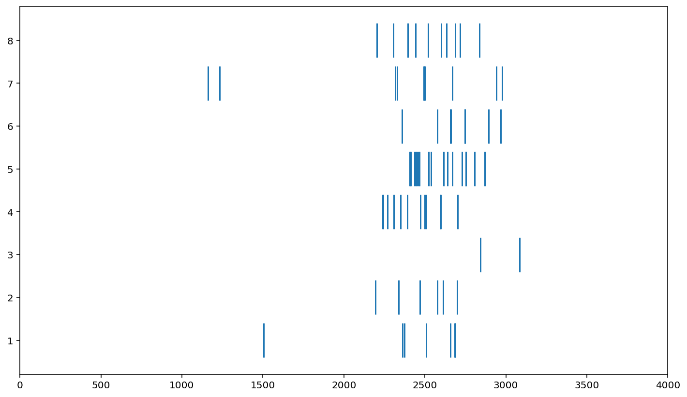
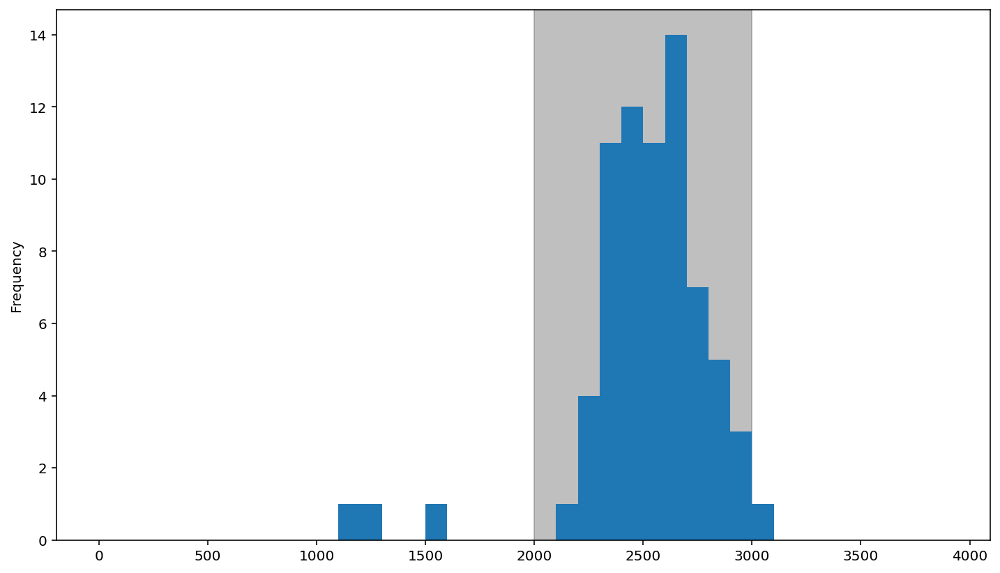

<div>
    <h1>EEG Data</h1>
</div>
<br /> <br/>
<div>
    <h1>Import Packages</h1>
    <p>Import all the needed packages for viewing a Raster Plot and PTSH.</p>
</div>
```python
import pandas as pd
import numpy as np
import matplotlib.pyplot as plt
```
<div>
    <h2>Read in the Data and Manipulate it</h2>
</div>
```python
df = pd.read_csv('crowder_data_all.csv')
```
<div>
    <p>Show a sample of what the Dataframe looks like.</p>
</div>
```python
df.sample(20)
```


<div>
<style scoped>
    .dataframe tbody tr th:only-of-type {
        vertical-align: middle;
    }

    .dataframe tbody tr th {
        vertical-align: top;
    }

    .dataframe thead th {
        text-align: right;
    }
</style>
<table border="1" class="dataframe">
  <thead>
    <tr style="text-align: right;">
      <th></th>
      <th>neuron</th>
      <th>spiketime</th>
      <th>repetition</th>
      <th>contrast</th>
      <th>condition</th>
    </tr>
  </thead>
  <tbody>
    <tr>
      <th>5872</th>
      <td>m2_9</td>
      <td>1959</td>
      <td>8</td>
      <td>12</td>
      <td>ADAPT</td>
    </tr>
    <tr>
      <th>21517</th>
      <td>m6_3b2</td>
      <td>3165</td>
      <td>8</td>
      <td>84</td>
      <td>ADAPT</td>
    </tr>
    <tr>
      <th>15868</th>
      <td>m3_3</td>
      <td>596</td>
      <td>7</td>
      <td>8</td>
      <td>ADAPT</td>
    </tr>
    <tr>
      <th>31393</th>
      <td>m6_17b</td>
      <td>27</td>
      <td>3</td>
      <td>84</td>
      <td>ADAPT</td>
    </tr>
    <tr>
      <th>1258</th>
      <td>m1_6</td>
      <td>627</td>
      <td>6</td>
      <td>32</td>
      <td>ADAPT</td>
    </tr>
    <tr>
      <th>19849</th>
      <td>m6_3b2</td>
      <td>2337</td>
      <td>2</td>
      <td>48</td>
      <td>CTRL</td>
    </tr>
    <tr>
      <th>15405</th>
      <td>m3_3</td>
      <td>1446</td>
      <td>1</td>
      <td>4</td>
      <td>ADAPT</td>
    </tr>
    <tr>
      <th>16215</th>
      <td>m3_3</td>
      <td>1324</td>
      <td>2</td>
      <td>16</td>
      <td>ADAPT</td>
    </tr>
    <tr>
      <th>29579</th>
      <td>m6_17b</td>
      <td>556</td>
      <td>7</td>
      <td>12</td>
      <td>ADAPT</td>
    </tr>
    <tr>
      <th>2604</th>
      <td>m2_9</td>
      <td>1802</td>
      <td>8</td>
      <td>12</td>
      <td>CTRL</td>
    </tr>
    <tr>
      <th>12958</th>
      <td>m2_13</td>
      <td>1125</td>
      <td>2</td>
      <td>100</td>
      <td>ADAPT</td>
    </tr>
    <tr>
      <th>9206</th>
      <td>m2_13</td>
      <td>3580</td>
      <td>1</td>
      <td>16</td>
      <td>CTRL</td>
    </tr>
    <tr>
      <th>7751</th>
      <td>m2_9</td>
      <td>324</td>
      <td>6</td>
      <td>64</td>
      <td>ADAPT</td>
    </tr>
    <tr>
      <th>14608</th>
      <td>m3_3</td>
      <td>2041</td>
      <td>4</td>
      <td>64</td>
      <td>CTRL</td>
    </tr>
    <tr>
      <th>21934</th>
      <td>m4_17</td>
      <td>2272</td>
      <td>5</td>
      <td>16</td>
      <td>CTRL</td>
    </tr>
    <tr>
      <th>2149</th>
      <td>m2_9</td>
      <td>770</td>
      <td>8</td>
      <td>4</td>
      <td>CTRL</td>
    </tr>
    <tr>
      <th>2626</th>
      <td>m2_9</td>
      <td>2859</td>
      <td>1</td>
      <td>16</td>
      <td>CTRL</td>
    </tr>
    <tr>
      <th>20393</th>
      <td>m6_3b2</td>
      <td>1029</td>
      <td>5</td>
      <td>4</td>
      <td>ADAPT</td>
    </tr>
    <tr>
      <th>10212</th>
      <td>m2_13</td>
      <td>3215</td>
      <td>5</td>
      <td>84</td>
      <td>CTRL</td>
    </tr>
    <tr>
      <th>4171</th>
      <td>m2_9</td>
      <td>203</td>
      <td>7</td>
      <td>84</td>
      <td>CTRL</td>
    </tr>
  </tbody>
</table>
</div>

<div>
    <p>Filter the data to get only the desired condition.</p>
</div>

```python
dat = df[(df['neuron'] == 'm1_6') & (df['condition'] == 'CTRL') & (df['contrast'] == 48)]
dat
```


<div>
<style scoped>
    .dataframe tbody tr th:only-of-type {
        vertical-align: middle;
    }

    .dataframe tbody tr th {
        vertical-align: top;
    }

    .dataframe thead th {
        text-align: right;
    }
</style>
<table border="1" class="dataframe">
  <thead>
    <tr style="text-align: right;">
      <th></th>
      <th>neuron</th>
      <th>spiketime</th>
      <th>repetition</th>
      <th>contrast</th>
      <th>condition</th>
    </tr>
  </thead>
  <tbody>
    <tr>
      <th>85</th>
      <td>m1_6</td>
      <td>1504</td>
      <td>1</td>
      <td>48</td>
      <td>CTRL</td>
    </tr>
    <tr>
      <th>86</th>
      <td>m1_6</td>
      <td>2361</td>
      <td>1</td>
      <td>48</td>
      <td>CTRL</td>
    </tr>
    <tr>
      <th>87</th>
      <td>m1_6</td>
      <td>2374</td>
      <td>1</td>
      <td>48</td>
      <td>CTRL</td>
    </tr>
    <tr>
      <th>88</th>
      <td>m1_6</td>
      <td>2508</td>
      <td>1</td>
      <td>48</td>
      <td>CTRL</td>
    </tr>
    <tr>
      <th>89</th>
      <td>m1_6</td>
      <td>2657</td>
      <td>1</td>
      <td>48</td>
      <td>CTRL</td>
    </tr>
    <tr>
      <th>...</th>
      <td>...</td>
      <td>...</td>
      <td>...</td>
      <td>...</td>
      <td>...</td>
    </tr>
    <tr>
      <th>152</th>
      <td>m1_6</td>
      <td>2602</td>
      <td>8</td>
      <td>48</td>
      <td>CTRL</td>
    </tr>
    <tr>
      <th>153</th>
      <td>m1_6</td>
      <td>2634</td>
      <td>8</td>
      <td>48</td>
      <td>CTRL</td>
    </tr>
    <tr>
      <th>154</th>
      <td>m1_6</td>
      <td>2689</td>
      <td>8</td>
      <td>48</td>
      <td>CTRL</td>
    </tr>
    <tr>
      <th>155</th>
      <td>m1_6</td>
      <td>2717</td>
      <td>8</td>
      <td>48</td>
      <td>CTRL</td>
    </tr>
    <tr>
      <th>156</th>
      <td>m1_6</td>
      <td>2838</td>
      <td>8</td>
      <td>48</td>
      <td>CTRL</td>
    </tr>
  </tbody>
</table>
<p>72 rows × 5 columns</p>
</div>

<div>
    <h2>Raster Plot</h2>
    <p>A Raster Plot shows each spike time in the EEG and plots it in a graph.</p>
</div>

```python
trial = dat['repetition']
fig, ax = plt.subplots()
ax.vlines(dat['spiketime'], trial - 0.4, trial + 0.4)

ax.set_xlim([0, trial_length])

plt.show()
```


    
    

<div>
    <h2>PTSH</h2>
    <p>A Peristimulus Histogram shows the times at which a neuron fires in a histogram format.</p>
</div>

```python

fig, ax = plt.subplots()

ax.axvspan(stim_on_time, stim_off_time, alpha=0.5, color='grey')

dat['spiketime'].plot(kind='hist', bins=range(0, trial_length, 100))

plt.show()
```


    
    


<div>
    <h2>New Data for More EEG Visualization</h2>
    <p>We will use this next data set for the rest of the examples.</p>
</div>
<div>
    <p>Import all of the packages needed for our visualization of EEG.</p>
</div>
```python
import mne 
mne.set_log_level('error')
import matplotlib.pyplot as plt
import numpy as np
import glob
from scipy import stats
from mne.stats import permutation_t_test
```
<div>
    <p>Read in the data and create a dictionary for the data.</p>
</div>
```python
conditions = ['Match', 'Mismatch']

data_dir = 'data_out/' 
data_files = glob.glob(data_dir + '*-ave.fif')

print(data_files)

evoked_dict = {}

for idx, c in enumerate(conditions): 
    evoked_dict[c] = [mne.read_evokeds(d)[idx] for d in data_files]

print(np.sum(evoked_dict['Mismatch'][0]._data == evoked_dict['Mismatch'][1]._data))
print(len(evoked_dict['Match']))
```

    ['data_out/l2_13-ave.fif', 'data_out/l2_25-ave.fif', 'data_out/l2_21-ave.fif', 'data_out/l2_24-ave.fif', 'data_out/l2_20-ave.fif', 'data_out/l2_16-ave.fif', 'data_out/l2_22-ave.fif', 'data_out/l2_14-ave.fif', 'data_out/l2_19-ave.fif', 'data_out/l2_23-ave.fif']
    0
    10
<div>
    <h2>Waveform Plot</h2>
    <p>Waveform plots show the average amplitudes of EEG compared between two different conditions.</p>
</div>

```python
electrodes = ['Cz', 'Pz']
color_dict = {'Match':'blue', 'Mismatch':'red'}
line_dict = {'Match':'-', 'Mismatch':'--'}

mne.viz.plot_compare_evokeds(evoked_dict,
                             combine='mean',
                             legend='lower right',
                             picks=electrodes, show_sensors='upper right',
                             colors=color_dict,
                             linestyles=line_dict,
                             title='Match vs. Mismatch Waveforms'
                            )

plt.show()
```


    

    

<div>
    <p>This code also shows a waveform plot, but instead of comparing the different averages, this one averages both conditions together.</p>
</div>

```python
diff_waves = []

for i in range(len(data_files)): 
    diff_waves.append(mne.combine_evoked([evoked_dict['Mismatch'][i], evoked_dict['Match'][i]],
                                          weights=[1, -1]
                                         )
                     )


contrast = 'Mismatch-Match'
mne.viz.plot_compare_evokeds({contrast:diff_waves}, combine = 'mean', 
                              legend=None, 
                             picks=electrodes, show_sensors = 'upper right', 
                             title=contrast
                            )
plt.show()
```


    

    

<div>
    <h2>Topographic Map</h2>
    <p>A scalp topographic map shows the average amplitude across different regions of the scalp with electrodes.</p>
</div>

```python
# scalp topographic map plotting 
mne.viz.plot_evoked_topomap(mne.grand_average(diff_waves),
                            times=0.600, average=0.200, 
                            title=contrast,
                            show_names=True,
                            contours=False,
                            size=4
                           )
plt.show()
```


    

    


<div>
    <p>Permutation t-test was performed because it corrects for multiple comparisons across multiple electrodes.</p>
</div>
```python
#Permutation t-tests
evoked_data2 = np.array([np.mean(e.get_data(tmin=.400, tmax=.600), axis=1) for e in diff_waves])


n_permutations = 50000
T0, p_values, H0 = permutation_t_test(evoked_data2, n_permutations, tail=-1)

#creating a new evoked set for p-values so we can create topomap
evoked_pval = mne.EvokedArray(-np.log10(p_values)[:, np.newaxis], 
                              evoked_dict[conditions[0]][0].info, tmin= 0.
                             )

# Creating a mask for the topomap 
mask = p_values[:, np.newaxis] <= 0.05

#Creating topomap across electrodes. 

evoked_pval.plot_topomap(times = 0, 
                         scalings = 1, 
                         cmap = 'Reds', 
                         vmin = 0, 
                         units = '-log10(p)', 
                         mask = mask, 
                         size = 4)
plt.show()
```


    

    


