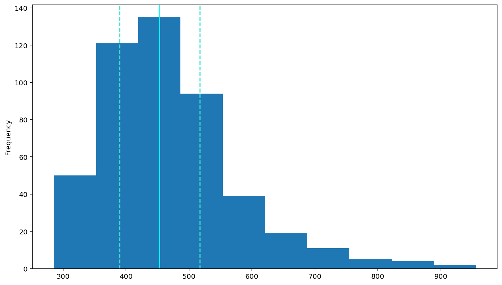
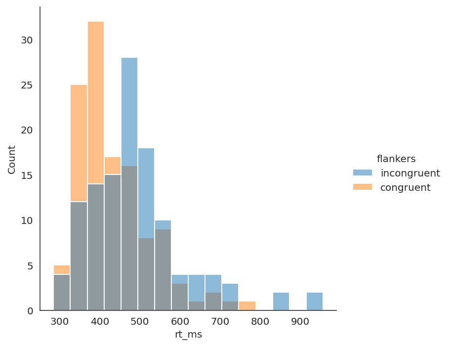

<div>
    <h1>Visualization Using Matplotlib.pyplot and Seaborn</h1>
</div>
<br /><br />
<div>
    <h2>Histogram</h2>
    <p>This code demonstrates how to generate a histogram using matplotlib.pyplot. The histogram also displays the median and the 25th and 75th percentiles.</p> 
</div>
```python
df.T.loc['rt_ms', :].plot(kind = 'hist')

plt.axvline(df['rt_ms'].describe()['25%'], 0, 1, color='turquoise', linestyle='--')
plt.axvline(df['rt_ms'].median(), 0, 1, color='cyan', linestyle='-')
plt.axvline(df['rt_ms'].describe()['75%'], 0, 1, color='turquoise', linestyle='--')

plt.show()
```



    


<div>
    <h2>Cumulative Distribution Plot</h2>
    <p>This code uses the same data to generate a cumulative distribution plot which type of histogram, it also shows the median, 25th, and 75th percentiles.</p>
</div>
```python
df.T.loc['rt_ms', :].hist(cumulative=True)

plt.axvline(df['rt_ms'].describe()['25%'], 0, 1, color='turquoise', linestyle='--')
plt.axvline(df['rt_ms'].median(), 0, 1, color='cyan', linestyle='-')
plt.axvline(df['rt_ms'].describe()['75%'], 0, 1, color='turquoise', linestyle='--')

plt.show()
```


    

    


<div>
    <h2>Altering Histograms</h2>
    <p>This code uses the same data as before to generate another histogram. This histogram is different because the code uses the log form of the data to generate the histogram. Manipulating the data in this way makes it easier for statistical analysis. The median, 25th, and 75th percentiles are shown as well.</p>
</div>
```python
import numpy as np

df['log_rt'] = np.log(df['rt_ms'])

df.T.loc['log_rt', :].plot(kind = 'hist')

plt.axvline(df['log_rt'].describe()['25%'], 0, 1, color='turquoise', linestyle='--')
plt.axvline(df['log_rt'].median(), 0, 1, color='cyan', linestyle='-')
plt.axvline(df['log_rt'].describe()['75%'], 0, 1, color='turquoise', linestyle='--')

plt.show()
```
    


<div>
    <p>This code uses the same data to generate a histogram with a more normal distribution enabling easier stastical analysis.</p>
</div>
```python
df.T.loc['rt_inv', :].plot(kind = 'hist')

plt.axvline(df['rt_inv'].describe()['25%'], 0, 1, color='turquoise', linestyle='--')
plt.axvline(df['rt_inv'].median(), 0, 1, color='cyan', linestyle='-')
plt.axvline(df['rt_inv'].describe()['75%'], 0, 1, color='turquoise', linestyle='--')

plt.show()
```


    

    


<div>
    <h2>Seaborn Distribution Plot</h2>
    <p>This code continues to use the same data as before but uses the Seabron package to create a distibution plot displaying different colors for different conditiond within the dataset.</p>
</div>
```python
df=df.reset_index()
sns.displot(data=df, x='rt_ms', hue='flankers')
plt.show()
```


    

    


<div>
    <h2>Seaborn Boxplot</h2>
    <p>This code continues to use the same dataset to display a boxplot using the Seaborn package. This graph generates a different colored box for each condition in the dataset.</p>
</div>
```python
sns.catplot(kind='box', data=df, x='flankers', y='rt_ms')

plt.show()
```


    

    


<div>
    <h2>Seaborn Barplot</h2>
    <p>This code continues to use the same dataset to generate a bar plot using the Seaborn package. This graph displays a different colored bar for each condition in the dataset.</p>
</div>
```python
sns.catplot(kind='bar', data=df, x='flankers', y='error')

plt.show()
```


    

    


